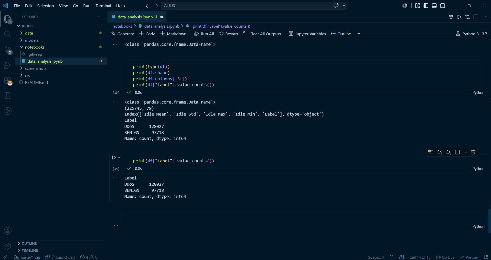
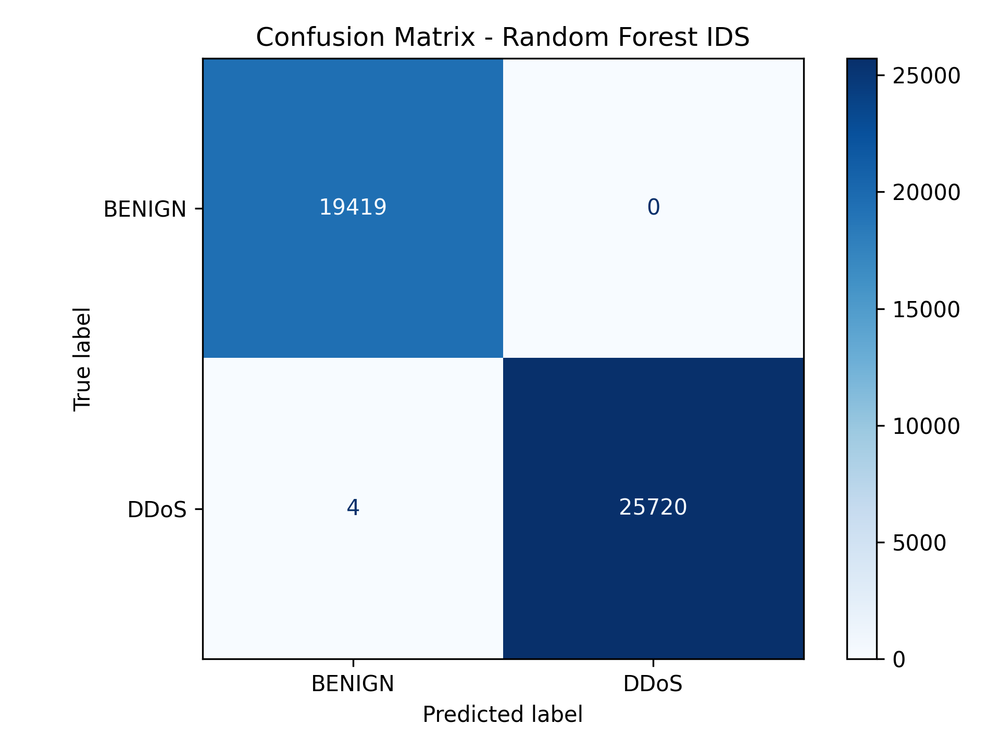

# AI-Based Intrusion Detection System


## Overview

This project aims to build an AI-based Intrusion Detection System (IDS) capable of identifying malicious network traffic and distinguishing it from benign traffic using machine learning techniques. The system analyzes network flow features and classifies different attack categories such as DDoS and Port Scanning.


## Problem Statement

Modern computer networks are vulnerable to attacks such as Distributed Denial of Service (DDoS), brute-force attacks, and port scanning. Traditional rule-based intrusion detection systems often fail to detect new or evolving attack patterns. This project explores the use of machine learning to improve intrusion detection by learning attack behavior from network traffic data.


## Dataset

Dataset Used: CIC-IDS2017

The dataset contains realistic network traffic generated from both benign user behavior and malicious attack scenarios. It includes 225,745 traffic records and 79 features describing flow-level characteristics such as packet count, flow duration, and packet length.


## Tech Stack

- Python
- Pandas
- NumPy
- Matplotlib
- Scikit-learn
- Jupyter Notebook
- Git & GitHub

## Project Structure

```bash
AI_IDS/
├── data/
├── notebooks/
├── models/
├── src/
├── screenshots/
└── README.md
```

## Workflow

1. Collect and load the dataset
2. Perform data cleaning and preprocessing
3. Analyze feature distributions
4. Train machine learning models
5. Evaluate model performance
6. Detect malicious network traffic


## Screenshots

### Label Distribution




## Current Status

* ✅ Dataset analysis completed
* ✅ Data preprocessing completed
* ✅ Random Forest model trained
* ✅ Model evaluation completed
* ✅ Model persisted as `ids_model.pkl`
* 🚧 Real-time traffic detection module in development


## Results

The Random Forest classifier was trained on 180,568 network traffic samples and evaluated on 45,143 unseen samples using an 80/20 train-test split.

### Performance Metrics

* Accuracy: 99.99%
* Precision: 100%
* Recall: 100%
* F1 Score: 100%

### Observations

The model achieved near-perfect classification performance on the selected CIC-IDS2017 DDoS dataset, with only 4 false negatives observed in the confusion matrix. The strong performance is likely due to the high separability between benign and DDoS traffic in this binary classification scenario.

### Current Limitation

The current model performs binary classification only (BENIGN vs DDoS). Multiclass intrusion detection for attacks such as PortScan, Bot, and Brute Force is planned in future iterations.


## Future Improvements

* Implement real-time packet capture
* Compare multiple machine learning models
* Deploy the IDS as a web dashboard
* Improve detection for zero-day attacks


## Author

Nischhal Bajpai  
B.Tech CSE | AI & Cybersecurity Enthusiast
